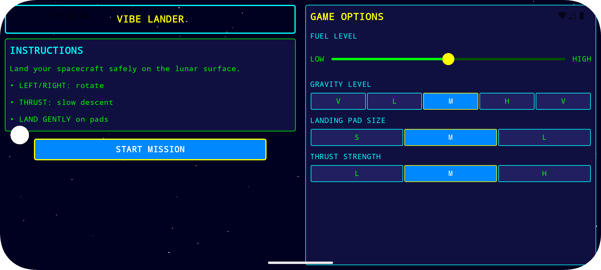
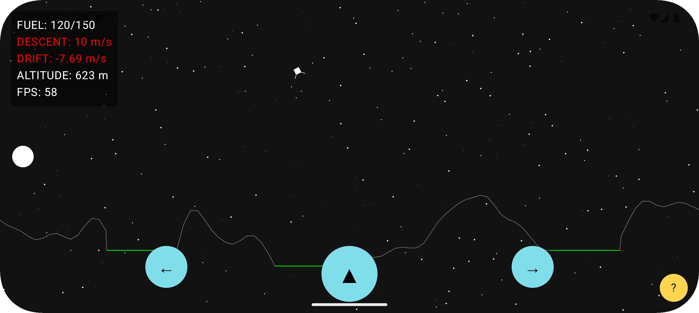
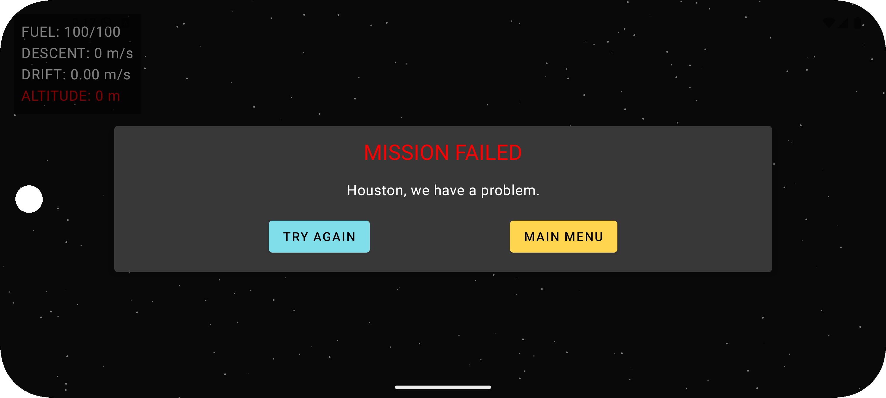
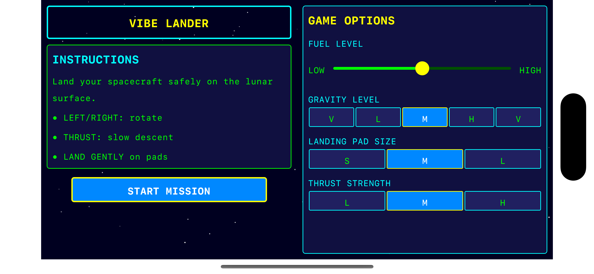
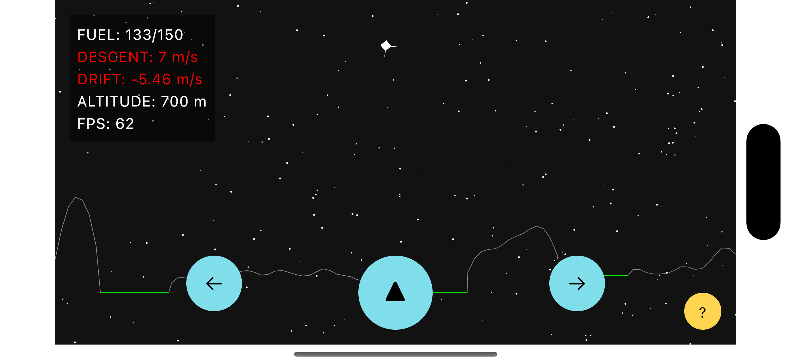
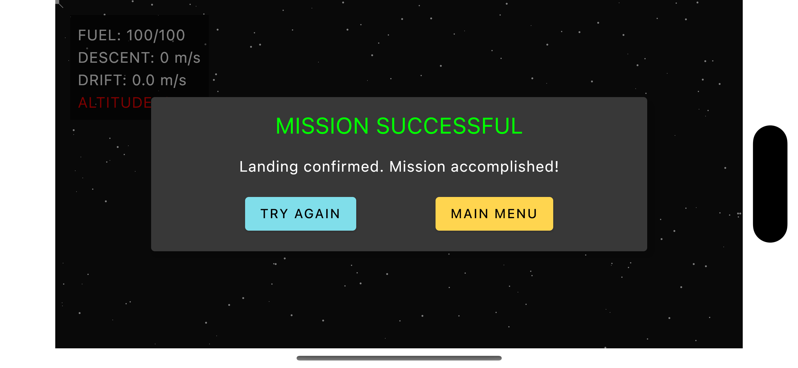
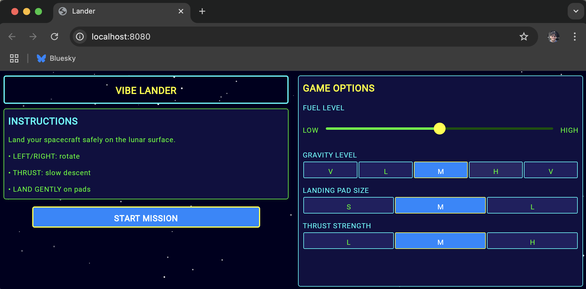
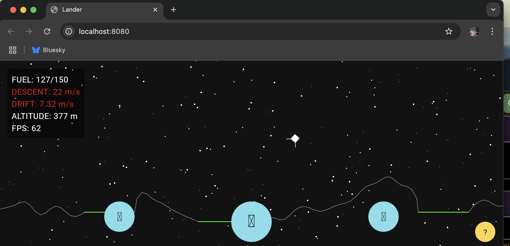

# VIBE LANDER

A retro-style Lunar Lander game built by me and Junie using Kotlin Multiplatform and Compose Multiplatform. 

major WIP

## ScreenShots
| Android                                          |
|--------------------------------------------------|
|          |
|            |
|   |

| ios                                                |
|----------------------------------------------------|
|                   | 
|   |
|  |  |

| web   |
|-------|
|  |
|  |
