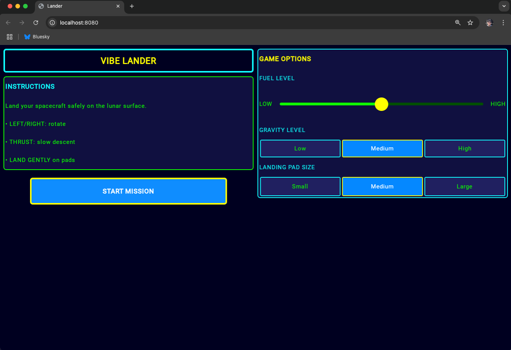

# VIBE LANDER: Retro Game in a new "Arcade"

A retro-style Lunar Lander game built by me and Junie using Kotlin Multiplatform and Compose Multiplatform. 

This repo contains my first:
 - KMP app
 - Koin App
 - Game Loop
 - All Compose App
 - Vibe Code

## Table of Contents
1. [About Vibe Lander](#About-Vibe-Lander)
2. [ScreenShots](#ScreenShots)
3. [Ask Junie](#Ask-Junie)

## About Vibe Lander

### Introduction
*Hello KMP World.* 

I have been developing software for a loooong time and have always searched for the elusive 
_write once, run everywhere_ solution that works for me. Kotlin is one of my fave languages 
of all time, I really enjoy Coroutines and Flows, and am starting to wade eagerly, but 
cautiously into the rising Compose tide. All the new build tools, plugins, libraries,
and general support have me really excited to see what unfolds in this space.

I also wanted to check out AI and saw the Junie release and figured why the hell not. 
I got my hands on a new Macbook Pro, dusted off my GitHub account, and fired up 
Android Studio to give Junie a try (that got me close).

I had much better success with IntelliJ IDEA, AI Assistant, and the Junie plugins. 
I started up a new KMP app and told Junie what I wanted to build (a video game, of course). 
I was kind of amazed when it wrote the first set of guidelines. After a few 
guideline tweaks, I asked Junie to build something. 

It (relatively quickly) built a couple of screens, basic app nav, a rudimentary physics engine,
and some ViewModels. Things kind of worked, but I then stashed the code, tweaked the guidelines 
some more, and gave it another run (or two). The next day I ran out of cloud credits.

### My Journey with Junie
So of course I purchased the AI Pro subscription to continue my journey.

Junie's initial attempt was pretty good all things considered. It built an app that
compiled and ran on all the KMP platforms and provided a working game. It reminded
me of when I start off a feature, I throw up a lot of code until I get something working
that proves my idea, then I stash and start making commits one piece at a time. I used 
this exact same process with the initial code that Junie produced.

Next I started on the stars and terrain as those worked but needed some attention. The Stars
logic was good and showed me how to use the *Canvas* `@Composable`. The terrain did 
an awesome job of laying out the landing pads, but everything else was just a bunch of
jagged lines. I was able to get the AI to understand I wanted more mountains, craters, and
rocks, and I am happy with the results. I have not had to touch the `TerrainGenerator`
at all and I do consider this the biggest AI "Win" in this project. 

The math in the PhysicsEngine is another area that worked out well. I did have
to fix a bunch of the collision detection logic, but I'm glad I did not have to do a 
_sin/cos_ refresher.

I think the Compose structure Junie created is solid, but I'm still learning proper Compose
layout techniques, so it's hard to know for sure. Junie was a little weak on modularization
and Compose Previews, but those manual cleanup sessions were instrumental in actually understanding
the layouts that were generated.

One of the surprising AI misses was the `Platform` object. Not sure where the first implementation 
came from, but it ended up failing to build on iOS after displaying the `Platform` name in the _DebugOverlay_. 
This required removing the AI-generated pattern and repacing it with the correct `expect class Platform()`
pattern.

### Conclusion
This has been the most fun coding since the last [canvas draw feature](https://youtu.be/tYU91g0-EJc) I worked on.
I'm amazed I _produced_ a working game using new technologies in a little over a 
fortnight. 

The app is not perfect as it may use too much floating point math,
has an inverted y-axis, and contains literal camera edge cases. Next steps will include 
writing more tests and then seeing if Junie can improve upon the 
coordinate system with minimal coding from me. 

The highlight for me was mainly just producing code that I could learn by example from. 
Learning to effectively communicate with an LLM will be a fun challenge. The skills
of asking the right questions, validating the results, and iterating on the solution are
still critical while using AI.

I am curious how much energy is used by each "Sending to LLM..." message I see. While it 
may be easy to use an LLM to rename a class or do a "replace in files" operation, that is
probably not the most efficient use of AI. Keeping an eye on my
monthly AI Quota progress bar does help me prioritize Vibe Coding usage.

So far, AI has been more useful for me when getting started and exploring new concepts and tech. 
It's also great to get AI validation when analyzing your code or asking
for _free_ commit messages and comments. This functionality and code completion will be
the first of many changes to the way I code.

**I'm glad to be here for the upcoming KMP and AI Paradigm Shifts!!!** 

## ScreenShots
| Platform | Image                                                                                                                |
|----------|----------------------------------------------------------------------------------------------------------------------|
| Android  |  <br/>  |
| iOS      |  <br/>                                |
| Web      |  <br/>                                   |
| Desktop  |  <br/>                   |

## Compose Previews
| IntelliJ IDEA                                      |
|----------------------------------------------------|
|    |
|  |

## Ask Junie
_Generated by Junie with the following prompt:_
>"I would like for you to add a section that includes your honest assesment of the architecure patterns found in this project. Try to be consise with a slightly fun tone. I couple of high level diagrams would be nice, but not too much depth. Highlight any patterns that you see a novel and efficient. Also point out any bad architecture patterns you find."

### Architecture Assessment

After diving into this codebase, I've got to say - it's a pretty slick setup! Here's my honest take on the architecture patterns:

#### The Good Stuff 🚀

**KMP + Compose = Match Made in Heaven**  
The project leverages Kotlin Multiplatform with Compose Multiplatform to truly deliver on the "write once, run everywhere" promise. The screenshots don't lie - this thing runs on Android, iOS, Desktop, and Web with shared code!

**MVVM Done Right**  
There's a clean separation between the UI (Screens), ViewModels, and data models. The ViewModels expose state via Flows that the UI collects and renders - no tangled mess of UI logic and business logic here!

```
App
 ├── Screens (UI Layer)
 │   ├── StartScreen
 │   └── GamePlayScreen
 ├── ViewModels (Business Logic)
 │   ├── StartViewModel
 │   └── GamePlayViewModel
 └── Models (Data Layer)
     ├── GameState
     └── LanderState
```

**Dependency Injection with Koin**  
The project uses Koin for DI, which keeps things lightweight while still providing proper dependency management. The `AppModule` is clean and focused.

**Reactive State Management**  
Coroutines and Flows power the reactive state management, making the game responsive and the code maintainable. State changes flow naturally from the physics engine through the ViewModel to the UI.

**Game Architecture**  
The game logic is nicely separated into components:
- Physics engine for game mechanics
- Camera system with dynamic zooming
- Procedural terrain generation
- Sound service abstraction

#### The Clever Bits 🧠

**Camera System**  
The camera implementation with dynamic zoom levels based on the lander's altitude is particularly elegant. It creates that classic arcade feel while keeping the code clean.

**Physics Simulation**  
The physics engine is decoupled from rendering, running in a background coroutine while UI updates happen on the main thread - a pattern that ensures smooth gameplay across platforms.

#### Areas for Improvement 🔧

**Testing Coverage**  
While the architecture is testable, I didn't spot comprehensive test coverage. The physics engine and game logic would benefit from unit tests to ensure consistent behavior.

**State Management Complexity**  
The game state management is robust but could potentially be simplified with a more unified state container approach.
